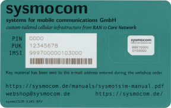

# 📶 GSM (2G) Network with LimeSDR and Osmocom

> **⚠️ Warning:** Setting up a GSM network involves using frequencies that are,
> in general, heavily regulated. In most jurisdictions, transmitting on these
> frequencies without proper authorization is against the law and subject to
> severe penalties.
>
> Familiarize yourself with your local telecommunications laws and be aware of
> the legal and operational risks involved, including the possibility of
> causing interference with emergency services and public communications. You
> might want to explore the possibility of using Faraday cages or direct
> connections from the base station (SDR) to the mobile station (such as a
> smartphone) to avoid unauthorized use of the spectrum.
>
> The author and publisher of this guide explicitly reject any liability for
> illegal use or any adverse outcomes resulting from following this guide. The
> responsibility for any actions taken rests entirely with you.

This guide provides a straightforward method to set up a basic GSM network
using a [LimeSDR], software from the [Osmocom] project, and a Linux-based
computer.

GSM is the second generation (2G) digital cellular network technology which
mobile communications have once relied on. It has long been obsoleted due to
its limitations and well-documented security vulnerabilities, being replaced by
newer standards such as UMTS (3G), LTE (4G) and, more recently, 5G. Remarkably,
despite its obsolescense, even the most current smartphones remain compatible
with GSM!

The setup outlined in this guide supports voice calls and SMS between the GSM
network's subscribers and is capable of providing emergency alerts over [CB
(Cell Broadcast)]. It also provides internet access, although the slow speeds
of 2G technologies (GPRS and EDGE) render it impractical for using modern
websites and apps, as even loading a simple page can take long minutes.

It should be possible to enable calls to and from other carriers by using the
[OsmoSIPConnector], PBX software, and a compatible SIP service provider.
However, that is beyond the scope of this guide, as its focus is on creating a
minimalist, self-contained network.

As for what is the practical purpose of setting up a GSM network, that is up to
you. It could simply be for entertainment value, or it could serve as a means
to explore the evolution of mobile communication protocols, including their
security aspects. These DIY GSM networks are sometimes showcased at hacker
events around the world as fun demonstrations, despite the questionable
legality (see the [warning] at the beginning of this guide).

[CB (Cell Broadcast)]:
  https://osmocom.org/projects/cellular-infrastructure/wiki/Cell_Broadcast
[LimeSDR]: https://limemicro.com/products/boards/limesdr/
[Osmocom]: https://osmocom.org/
[OsmoSIPConnector]: https://osmocom.org/projects/osmo-sip-conector
[warning]: #-gsm-2g-network-with-limesdr-and-osmocom

### What about 3G and up?

The Osmocom project does support the UMTS standard; however, its
[documentation] indicates the need for a third-party hNodeB, a separate
hardware component.

While the LimeSDR hardware is probably capable of handling the protocol, I
haven't been able to find documentation on anyone successfully using it for
that purpose. Online searches have led me to [OpenBTS-UMTS], a now-discontinued
project, making it challenging to find supporting resources. Given these
difficulties, and since 2G met my experimental needs, I have decided not to
pursue 3G.

For 4G and beyond, the [srsRAN] project is well-established, and provides
examples such as a setup [using a Raspberry Pi 4 and SDRs to create an eNodeB].
While I haven't experimented with this yet, it is certainly on my future
project list.

[documentation]:
  https://osmocom.org/projects/cellular-infrastructure/wiki/Osmocom_Network_In_The_Box
[OpenBTS-UMTS]: https://github.com/RangeNetworks/OpenBTS-UMTS
[srsRAN]: https://www.srslte.com/
[using a Raspberry Pi 4 and SDRs to create an eNodeB]:
  https://docs.srsran.com/projects/4g/en/next/app_notes/source/pi4/source/index.html

## Security Considerations

It's clear that 2G technology is outdated and insecure. No GSM network should
be considered safe for transmitting sensitive information. Additionally,
creating a GSM network like this could pose risks to both the host system and
any other networks (e.g. Ethernet and Wi-Fi) connected to it.

The Osmocom project's components use a variety of TCP ports for different
purposes. One key feature is the VTY (virtual terminal), which allows a user to
connect, monitor, and tweak settings on a running component. In the setup we're
discussing, these ports are configured to only accept connections from the
local machine (localhost) and don't require any authentication. This means that
anyone with access to the system could potentially log in, run commands, and
change the settings of any active Osmocom component.

If this level of access doesn't suit your needs, you'll need to dive into the
configuration files to tighten security, and consider strategies such as
firewall rules that distinguish between users, utilizing network namespaces,
among others.

Keep in mind that, as your GSM network offers internet access, there's a chance
subscribers might misuse it. Forwarding packets could inadvertently expose
other devices on your networks to unauthorized access from the GSM network
users. As such, it's wise to implement appropriate firewall rules.

## Setup

These setup instructions are based on a Debian 12 (“bookworm”) environment with
a LimeSDR connected via USB. Should your setup differ, you may have to make
adjustments to these steps.

### Deciding on authentication

In 2G networks, unlike on 3G/4G/5G, the network authenticates the subscribers,
but the mobile devices are not required to authenticate the network itself. In
effect, this means you can choose to have an “open” network that authenticates
any device attempting to connect to it and, as such, does not require a custom
SIM card to be used.

Your decision on whether to enforce authentication or not will significantly
impact how users connect to your network and the technical steps required for
your setup.

_If you opt to enforce authentication,_ you will need programmable SIM cards
and must program them with specific network parameters, including the PLMN[^1]
lists and the authentication key (Ki)[^2]. Furthermore, you'll need to add each
subscriber to the network database managed by OsmoHLR.

_If you decide for an “open” network,_ users can manually select your network
by disabling automatic network selection in their phone's settings. Even
without enforcing authentication, you can still use programmable SIM cards for
automatic connection to your network (i.e. so automatic network selection
doesn't need to be disabled), although those are not required for connection.

[^1]:
    **PLMN (Preferred List of Mobile Networks)** refers to a list stored on a
    SIM card containing the mobile networks that the subscriber should connect
    to. This list is used by the mobile phone to automatically select one of
    the networks when they are available.

[^2]:
    **Ki** is a 128-bit value used in the authentication and ciphering process
    between the mobile device and the GSM network. It is stored both in the
    subscriber's SIM card and the network's database, and is used to
    authenticate the authorized users to the network.

### Programmable SIM cards



For programmable SIM cards, [sysmocom] is a renowned and reliable provider.
Alternatively, marketplaces like Banggood and AliExpress offer inexpensive
writeable SIM cards, though quality and features can vary.

One possible concern with SIM cards from these marketplaces is that they may
sometimes require software provided by the vendors for writing parameters to
them. Often, this software can be best described as opaque — its origins and
functionalities are not transparent, raising legitimate concerns about security
and integrity. There's a real risk of them containing malware.

If you find yourself needing to use vendor-provided software from these less
reputable sources, you should take precautions such as running the software
within an isolated virtual machine.

[sysmocom]: https://shop.sysmocom.de/SIM/Cards/

### Install required packages

First up, add the Osmocom project repository to your system. On Debian, the
simplest route to do so is by using [extrepo]. For other Linux flavors, refer
to the [Osmocom wiki].

```bash
apt install extrepo
extrepo enable osmocom-latest
apt update
```

Next, proceed to install the following packages.

```bash
apt install git            \
            telnet         \
            iptables       \
            limesuite      \
            osmo-hlr       \
            osmo-msc       \
            osmo-mgw       \
            osmo-stp       \
            osmo-bsc       \
            osmo-ggsn      \
            osmo-sgsn      \
            osmo-bts-trx   \
            osmo-trx-lms   \
            osmo-pcu       \
            osmo-cbc       \
            osmo-cbc-utils
```

If you haven't done so yet, you might want to take this opportunity to check
that your LimeSDR is connected, updated and working properly, by running
`LimeUtil --update` and `LimeQuickTest`.

[extrepo]: https://manpages.ubuntu.com/manpages/focal/man1/extrepo.1p.html
[Osmocom wiki]:
  https://osmocom.org/projects/cellular-infrastructure/wiki/Latest_Builds

### Clone the repository

This repository contains the basic configuration files and auxiliary scripts
needed for our setup. Clone it using Git.

```bash
git clone git@github.com:miraliumre/gsm.git
```

### Customize settings

Within the cloned repository, navigate to `etc/osmocom` for the relevant
Osmocom configuration files. Update these files based on your network
preferences.

**First, in [osmo-bsc.cfg],** set the MCC[^6] and MNC[^7] for your network. As
defaults, we have set 724 as the MCC because it is associated with Brazil, and
64 as the MNC to avoid conflicts with existing Brazilian carriers' MNCs.

```
network country code 724
mobile network code 64
```

**In [osmo-ggsn.cfg],** you have the option to customize DNS and IP settings to
avoid conflicts with your existing networks.

```
ip dns 0 8.8.8.8
ip dns 1 8.8.4.4
ip prefix dynamic 172.16.32.0/24
```

**Next, in [osmo-hlr.cfg],** note the following directives:

- `ussd route prefix *#100# internal own-msisdn` provides a USSD[^3] service to
  display the user's MSISDN[^4] by dialing `*#100#`.

- `ussd route prefix *#101# internal own-imsi` provides a USSD service for
  viewing the SIM card's IMSI[^5] by dialing `*#101#`.

- `subscriber-create-on-demand 8 cs+ps` enables auto-registering for devices
  attaching to the network. It declares that each device should be assigned an
  8-digit MSISDN, and be allowed to access both CS and PS services.

**Edit [osmo-msc.cfg]** to match the MCC and the MNC that you have previously
set on `osmo-bsc.cfg`. Here, you might also want to personalize the short name
and long name of your network. If you decide to require authentication, you
must change the authentication line to `authentication required`.

```
network country code 724
mobile network code 64
short name Miralium
long name MiraliumResearch
authentication optional
```

**In [osmo-sgsn.cfg],** if you decide to require authentication on your
network, you might want to change the `auth-policy accept-all` line to
`auth-policy closed`.

**Finally,** copy all the configuration files to the `/etc/osmocom` directory
on your system. A script for doing so is provided under [src/update-cfg.sh] for
convenience.

[^3]:
    **USSD (Unstructured Supplementary Service Data)** is a messaging
    technology allowing a session-based, two-way exchange of a sequence of
    data. One of its uses is providing users with access to network services by
    dialing short codes, typically starting with \* and ending with #, without
    the need for an internet connection.

[^4]:
    **MSISDN (Mobile Station International Subscriber Directory Number)** is a
    number uniquely identifying a subscription in the GSM network. Simply put,
    it is the phone number. It is stored on the network's database, where it
    can be looked up in relation to the IMSI.

[^5]:
    **IMSI (International Mobile Subscriber Identity)** is a unique identifier
    for each user of the network. It is stored on the SIM card, composed of up
    to 15 digits, and structured to include the MCC, the MNC, and a unique
    subscriber number.

[^6]:
    **MCC (Mobile Country Code)** is a three-digit code assigned to each
    country, used to identify the country in which a mobile subscriber belongs.

[^7]:
    **MNC (Mobile Network Code)** is a two or three-digit code used in
    combination with the MCC to identify a mobile phone operator within a
    country. Each operator has unique MNCs (often more than one), which, when
    paired with the MCC, forms an unique operator identification worldwide.

[osmo-bsc.cfg]: etc/osmocom/osmo-bsc.cfg
[osmo-ggsn.cfg]: etc/osmocom/osmo-ggsn.cfg
[osmo-hlr.cfg]: etc/osmocom/osmo-hlr.cfg
[osmo-msc.cfg]: etc/osmocom/osmo-msc.cfg
[osmo-sgsn.cfg]: etc/osmocom/osmo-sgsn.cfg
[src/update-cfg.sh]: src/update-cfg.sh

### Set up routing

As per our configuration, OsmoGGSN will use a TUN interface named `apn0` from
which the GSM network subscribers will reach the internet. For it to work,
you'll be required to:

1. create the TUN interface;

   ```bash
   ip tuntap add dev apn0 mode tun user root group root
   ```

2. add an IP address to the newly created interface (in accordance with the
   settings in `osmo-ggsn.cfg`);

   ```bash
   ip addr add 172.16.32.1/24 dev apn0
   ```

3. bring the interface up;

   ```bash
   ip link set apn0 up
   ```

4. enable [IP forwarding] (e.g. by editing `/etc/sysctl.conf` to add the
   `net.ipv4.ip_forward = 1` line and loading the changes with `sysctl -p`);

5. configure iptables for NAT on the relevant network interfaces.
   ```bash
   iptables -t nat -A POSTROUTING -o eth0 -j MASQUERADE
   iptables -t nat -A POSTROUTING -o apn0 -j MASQUERADE
   ```

On this last step, you'll be required to replace `eth0` with the name of the
network interface on your computer that is connected to the internet.

Remember that additional setup might be required to make these changes to
iptables persist across reboots. You may want to use the [iptables-persistent]
package.

> **ℹ️ Heads up:** manually setting iptables rules while [UFW] is installed and
> enable can cause conflicts. For this setup, it is recommended that you
> uninstall UFW and use iptables directly.

[IP forwarding]:
  https://openvpn.net/faq/what-is-and-how-do-i-enable-ip-forwarding-on-linux/
[iptables-persistent]: https://packages.debian.org/bookworm/iptables-persistent
[UFW]: https://help.ubuntu.com/community/UFW

### Start the Osmocom services

Use the [src/osmo-all.sh] convenience script to start all the required
Osmocom services (i.e. by running `src/osmo-all.sh start`). It is likely that
the services had already been started automatically when you installed them, so
it is recommended to completely stop them by running `src/osmo-all.sh stop`
(and, possibly, `src/osmo-all.sh kill`, if needed) before starting them
again.

[src/osmo-all.sh]: src/osmo-all.sh

## Network Usage

If your GSM network has been set up to require authentication, connecting to it
is straightforward, assuming your SIM card has been programmed correctly.
Simply insert the SIM card into the mobile device, and it should automatically
find and connect to the network.

In the case you are not using custom SIM cards, the connection process involves
a few more steps, and these steps can vary significantly depending on the
mobile device's operating system. For Android devices, navigate to _Settings_ ›
_Network & internet_ › _Mobile network_, locate the option for _Automatically
select network_ and disable this toggle.

After disabling the automatic selection, your device will search for available
networks and present them to you. Your GSM network may not appear on the list
by the configured name, but rather, as a numerical representation composed of
the MCC and the MNC you have configured (e.g. “72464”). Upon selecting it, your
device should connect to your network.


### Managing subscribers

You can manage subscribers via the OsmoHLR's VTY interface. By default, OsmoHLR
binds its VTY to TCP port `4258`. To connect, you may use `telnet`, as follows.

```bash
telnet 127.0.0.1 4258
```

Upon successful connection, you will be presented with the OsmoHLR command
prompt. To begin with, enter the `enable` mode.

```shell
OsmoHLR> enable
```

You may list all available commands, as well as get help for a specific
command's parameters, by pressing the `?` key.

For networks that require authentication, it's necessary to add subscribers
manually, specifying their IMSI and Ki values. To create a subscriber, refer to
the following example, and replace the placeholder IMSI 724640000000000 with
the actual IMSI of the SIM card you are registering.

```shell
OsmoHLR# subscriber imsi 724640000000000 create
% Created subscriber 724640000000000
    ID: 1
    IMSI: 724640000000000
    MSISDN: none
```

Now, assign a MSISDN to your subscriber. In this case, we'll be using 12345678.
Remember, this is a placeholder and should be replaced with the actual phone
number you wish to assign.

```shell
OsmoHLR# subscriber imsi 724640000000000 update msisdn 12345678
% Updated subscriber IMSI='724640000000000' to MSISDN='12345678'
```

Next, specify the authentication parameters. This example uses `comp128v1` as
the AUC algorithm, but depending on your SIM card settings, `comp128v3` may be
required. The Ki (authentication key) provided here is a placeholder and must
be replaced with the actual Ki of your SIM card.

```shell
OsmoHLR# subscriber imsi 724640000000000 update aud2g comp128v1 ki 00000000000000000000000000000000
```

Specify the network access mode (e.g., cs+ps for both circuit-switched and
packet-switched access).

```shell
OsmoHLR# subscriber imsi 724640000000000 update network-access-mode cs+ps
```

To view the updated information for a subscriber, use the show command.

```shell
OsmoHLR# subscriber imsi 724640000000000 show
    ID: 1
    IMSI: 724640000000000
    MSISDN: 12345678
    2G auth: COMP128v1
             KI=00000000000000000000000000000000
```

### Calls and SMS

Once a device is connected to the GSM network, calls and SMS should _just
work_. To figure out the phone numbers to call and/or send messages to, look up
each subscriber's MSISDN. You can either do this directly from the host system
(e.g. by querying the OsmoHLR VTY) or by using the USSD service on a mobile
phone to find out its assigned number (dial `*#100#`).

### Internet access

Unlike with calls and SMS, internet access through your GSM network might
require some additional configuration on the mobile device itself.

First off, if your GSM network is set up without authentication, or if your
SIM's PLMN settings are incorrect, the mobile device might think it's
[roaming]. This often means it'll automatically turn off data to avoid charges.
To get around this, you may either tweak your SIM's configuration, which is
only possible if you are using your own programmable SIM cards, or [enable data
roaming].

To determine if your Android mobile phone is in roaming, simply look at the
status bar at the top of your phone's screen. If you see an "R" next to your
signal strength bars, this indicates that the phone is currently in roaming
mode.

  
_"Roaming symbol shown on an Android smartphone" by The RedBurn, Mark Groves on
[Wikimedia Commons]_

Next up, your device will require APN (Access Point Name) settings to
successfully access the internet. Usually, carriers push these settings to
subscribers through [OTA updates], but here, we'll just set it up manually.

For Android users, head to _Settings_ › _Network & internet_ › _Mobile network_
› _Access Point Names_. Here, add a new APN with any name and APN value you
prefer. Just ensure the MCC and MNC matches your setup. After that, save your
new APN and select it to get connected.

I have seen older, non-Android phones with different setup requirements. In
those cases, you might need to browse through the menus and figure out which
configurations may be missing.

[roaming]: https://en.wikipedia.org/wiki/Roaming
[Wikimedia Commons]:
  https://commons.wikimedia.org/wiki/File:Roaming_symbol_Android.svg
[enable data roaming]: https://www.youtube.com/watch?v=bhRNJJK0-aA
[OTA updates]: https://stackoverflow.com/a/63635659

## Emergency alerts


You can broadcast emergency alerts on the GSM network using the REST API
provided by OsmoCBC. The `osmo-cbc-utils` package provides a command line tool
named `cbc-apitool.py` to interact with said API.

For example, the following command sends an Extreme Alert message to the
network.

```bash
cbc-apitool.py create-cbs    \
               --msg-id 4371 \
               --payload-data-utf8 "Something has happened."
```

From my experience, transmitting these alerts and ensuring that they are
successfully received by the devices on the network can be somewhat tricky. As
such, it's advisable to familiarize yourself with the specifics of CB
technology.

Some issues you might run into:

- Devices might have emergency alert messages disabled, or in rare cases, may
  not support them at all.

- Messages that share the same ID and update number are treated as identical,
  regardless of any differences in their content. Therefore, if you create
  message with a specific ID, delete it, and then try to issue a new message
  without altering the update number, devices that received the initial message
  might not display the subsequent one.

- Content length and character encoding issues may cause the alerts not to be
  displayed by the devices.

> **ℹ️ Heads up:** on Android, emergency alert settings are usually under
> _Settings_ › _Notifications_ › _Wireless emergency alerts_. On iOS, look for
> _Settings_ › _Notifications_ › _Government Alerts_.
>
> 

## Further Reading

Cellular technology and its related components, including the Osmocom project,
are fascinatingly complex. Although this guide gives you a straightforward path
to setting up a GSM network quickly, you might want to dive in deeper to
further your understanding.

The Osmocom project offers their own configuration guide for a basic and
minimal setup of a 2G/3G network. It goes into more detail about each
component, illustrating the relationship and communication flow between them.

- [Osmocom Network In The Box]

Additionally, each component within the Osmocom project has its own user manual
and VTY reference, all accessible on the project's website.

- [Osmocom Docs]

[Osmocom Network In The Box]:
  https://osmocom.org/projects/cellular-infrastructure/wiki/Osmocom_Network_In_The_Box
[Osmocom Docs]: https://downloads.osmocom.org/docs/

### Contributions

This repository is open for contributions! If you've spotted a mistake, have
suggestions for improvements, or want to expand on the content, please feel
free to open an issue or submit a pull request.

## Acknowledgements

This guide builds upon the work of [Lucas Teske], who first wrote about this
topic back in 2019, and later talked about it at the [RF Village] at the [H2HC]
in 2022.

A huge shoutout is also due to the entire open source community that has
created and supports projects such as the LimeSDR and Osmocom. It is because of
these efforts that individuals and small business can now research complex
radio communication protocols without shelling out massive amounts of cash for
high-end equipment typically reserved for the giants in the telecom industry.

[Lucas Teske]:
  https://lucasteske.dev/2019/12/creating-your-own-gsm-network-with-limesdr/
[RF Village]: https://github.com/racerxdl/h2hc-rfvillage
[H2HC]: https://www.h2hc.com.br/
